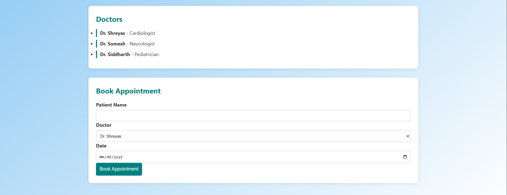

# Hospital Management System

A web-based Hospital Management System developed using PHP, MySQL, HTML, CSS, JavaScript, and Bootstrap.

## Features
- Appointment Booking
- Admin Panel
- Contact Form
- Feedback System
- Patient Records
- Doctor Information

## Technologies Used
- HTML5
- CSS3
- JavaScript
- PHP
- MySQL
- Bootstrap 5
- XAMPP

## How to Run
1. Install XAMPP
2. Copy project folder to htdocs
3. Import hospital.sql in phpMyAdmin
4. Start Apache and MySQL
5. Open localhost/project-folder-name

## Screenshots

### Home Page

### Appointment Form

### Appointment Database

### Doctors Section

### Contact Us

### Contact Database

### Feedback Form

### Feedback Database

## Author
Shreyas Bhagwat

